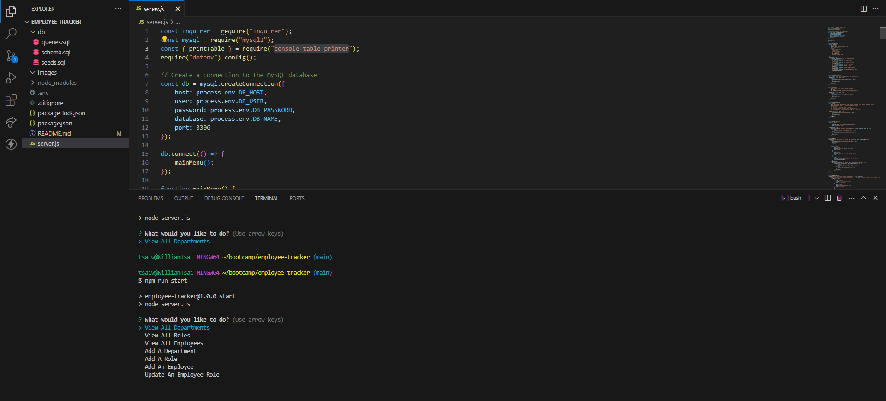

# employee-tracker

## Description 

The motivation building the employee tracker was to create a practical and efficient tool to organize and plan a company's structure.

This application solves the problem of manual data management and organization for business owners. By leveraging Node.js, Inquirer, and MySQL, the application provides a streamlined and user-friendly interface for interacting with the employee database. It allowsyou to view, add, update, and organize information about departments, roles, and employees, enhancing their ability to plan and make informed decisions about their company's structure and workforce.

Through this project, I learned the intricacies of building a command-line application using Node.js, handling user input with Inquirer, and integrating a MySQL database for data storage. I gained valuable insights into structuring and managing database queries, ensuring data integrity, and providing an intuitive user experience through the command line. Additionally, this project highlighted the importance of developing tools that cater to the specific needs of businesses, showcasing the practical applications of technology in enhancing organizational efficiency and decision-making. Overall, it deepened my understanding of full-stack development and the significance of creating solutions that bridge the gap between technical and non-technical stakeholders.

## Video Demo URL

## Installation

Installed the program using npm init -y and npm i. Must also make sure that console-table-printer, mysql2, and inquirer modules are installed. 

Go to the db folder and run mysql -u root to access the mysql interface. Run source schema.sql and seeds.sql to add the database and its entries.

Then, move out of the folder and run the program using npm run start.

## Usage

The following image shows the web application's appearance and functionality:

## Credits

N/A

## License

N/A
